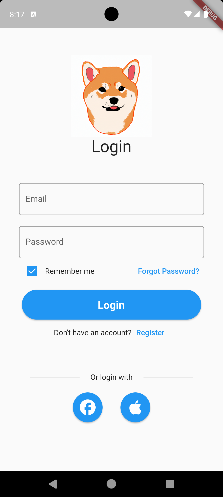

## Table of Contents
* [Motivation](#motivation)
* [Goals](#goals)
* [Usage](#usage)
* [Installation](#installation)
* [Development Status](#development-statuds)
* [About Us](#about-us)

## Motivation

There are many people who are or want to be pet owners, but don't know all there is to know regarding pet nutrition and health. PetBite seeks to change that by making it quick and easy to see what a pet's nutritional needs are. 

## Goals

Our primary goal is to have a functioning mobile app in which users can receive direct feedback regarding their pet's nutritional needs based on pet information such as weight, height, breed, and age. The app will provide feedback via chatGPT as well as other users who have similar pets. In service of making pet nutrition and health easy to digest, we also have a tracker that keeps track of a pet's meal and exercise times, as well as a pet food page with information and links to buy brands of pet food. Lastly, our app also aims to encourage community interaction and will have a message board where users can create and respond to posts.  

## Usage

* ### Login Page
Users will be able to login through this page using their credentials, or through a linked facebook/apple account. If a user has forgotten their password or doesn't have an account, they can press the "Forgot Password?" or "Register" buttons respectively to be redirected to the appropriate page. 

## Installation

Our project code can be found [here](https://github.com/PetBite/app)

In order to run our code simply:
- download the repo from the provided link
- invoke flutter run

## Development Status

Our development status can be found [here](https://github.com/orgs/PetBite/projects/1)

## About Us

Our team consists of three members:
- [Braydon Nagasako](https://github.com/Breadonn)
- [Wenhao Qiu](https://github.com/wenhaoq20)
- [Keaton Wong](https://github.com/KeatonWong)
