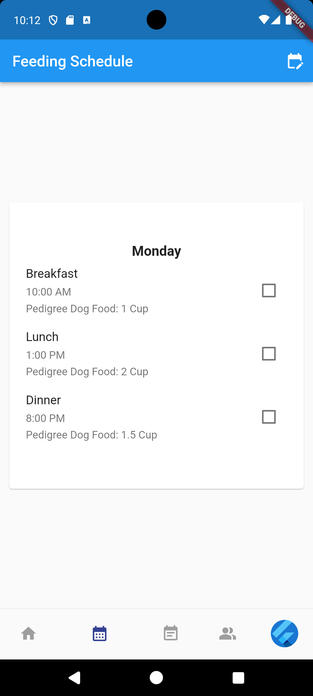
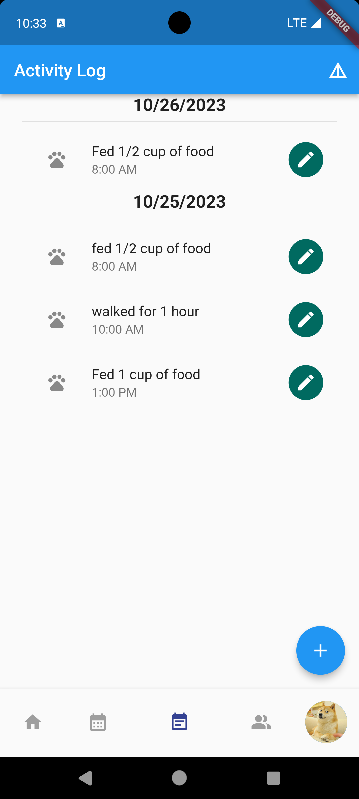
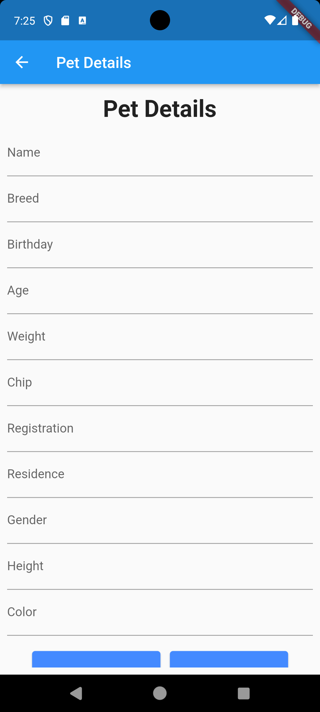
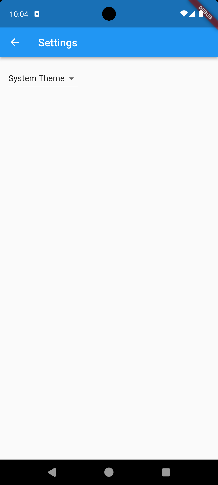

## Table of Contents
* [Motivation](#motivation)
* [Goals](#goals)
* [Usage](#usage)
* [Installation](#installation)
* [Development Status](#development-statuds)
* [About Us](#about-us)

## Motivation

There are many people who are or want to be pet owners, but don't know all there is to know regarding pet nutrition and health. PetBite seeks to change that by making it quick and easy to see what a pet's nutritional needs are. 

## Goals

Our primary goal is to have a functioning mobile app in which users can receive direct feedback regarding their pet's nutritional needs based on pet information such as weight, height, breed, and age. The app will provide feedback via chatGPT as well as other users who have similar pets. In service of making pet nutrition and health easy to digest, we also have a tracker that keeps track of a pet's meal and exercise times, as well as a pet food page with information and links to buy brands of pet food. Lastly, our app also aims to encourage community interaction and will have a message board where users can create and respond to posts.  

## Usage

* ### Login Page
Users will be able to login through this page using their credentials, or through a linked facebook/apple account. If a user has forgotten their password or doesn't have an account, they can press the "Forgot Password?" or "Register" buttons respectively to be redirected to the appropriate page.

* ### Register Page
Users can create a PetBite account on this page by providing a username, a valid email address, a password, and their phone number. Users are also required to read and agree to the Terms and Conditions of the application.

* ### Home Page
After logging in, the user is presented with the home page. If the user is new to the application, they would be asked to enter and upload information about their pet. Once the pet's information is entered, the user would see an overview of their pet's information and AI-generated tips for their pet. If the user has multiple pets entered into the application, they can switch to different pets by swiping up on this screen and a navbar would appear at the top of the screen. The navbar contains a row of the owner's pet pictures and the user can switch to different pet's page by clicking on one of the pictures.

* ### Feeding Schedule Page
Users can choose between an AI-generated feeding schedule or enter their own feeding schedule for their pet. The schedule card can be swiped to different days of the week and each card would display what the pet should eat on that day. The card displays various information such as the time of the meal, the amount of the meal, and a checkbox for completion. The feeding schedule can also be synchronized with the pet's activity and health, so the schedule can be adjusted in real time as needed.

* ### Activity Log Page
Users can log their pet's daily activities on this page. Logs are tracked in a simple scrolling list of activities, all of which are time stamped. The plus button on the bottom right allows the user to add activity logs. Activities are also separated by day markers.

* ### Community Forum Page
Users can communicate with other users in this application through this screen, which includes a scrolling bar at the top of the application with circles representing different communities. The selected community is highlighted at the top to indicate which community the user is currently in. Below that are post previews from other users. Each post preview includes a like, comment, and share button/status. The preview shows the post's title, content, and images, if uploaded. When a user clicks on one, the page changes to the post page where they can view the post in more detail. At the bottom of the page is a plus sign that allows the user to write their own post. Clicking this button takes the user to the Create Post page.

* ### DM List Page
Users can check their private conversation with other users on this page.

* ### Pet Food List Page

* ### Detailed Pet Food Page

* ### Pet Details Page

* ### Settings Page

## Installation

Our project code can be found [here](https://github.com/PetBite/app)

In order to run our code simply:
- download the repo from the provided link
- invoke flutter run

## Development Status

Our development status can be found [here](https://github.com/orgs/PetBite/projects/1)

## About Us

Our team consists of three members:
- [Braydon Nagasako](https://github.com/Breadonn)
- [Wenhao Qiu](https://github.com/wenhaoq20)
- [Keaton Wong](https://github.com/KeatonWong)
