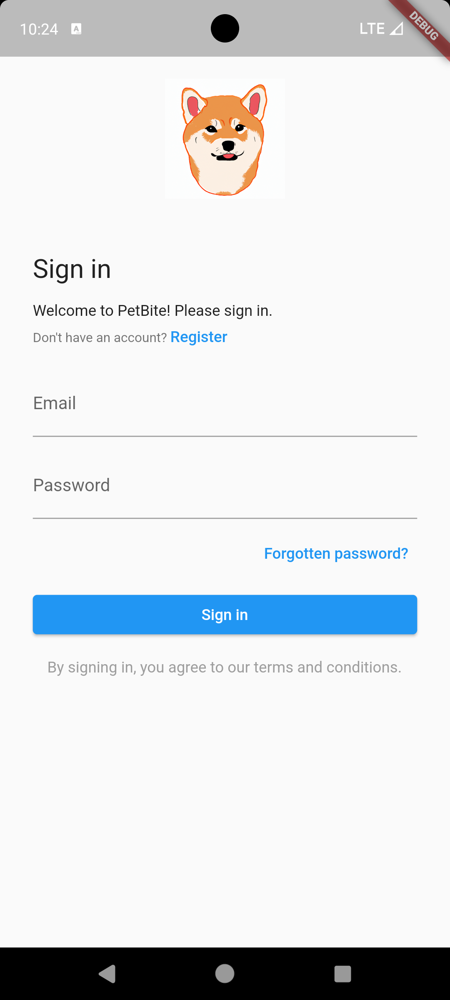
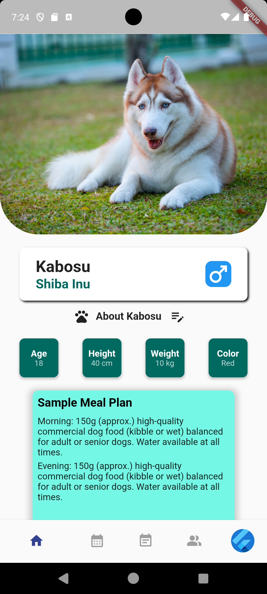
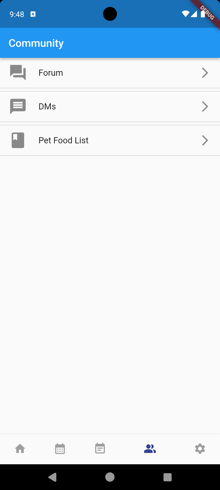
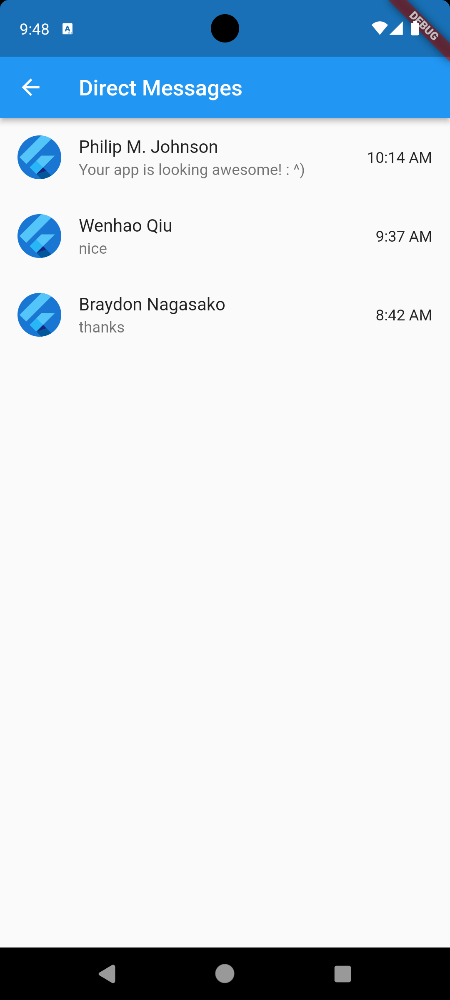
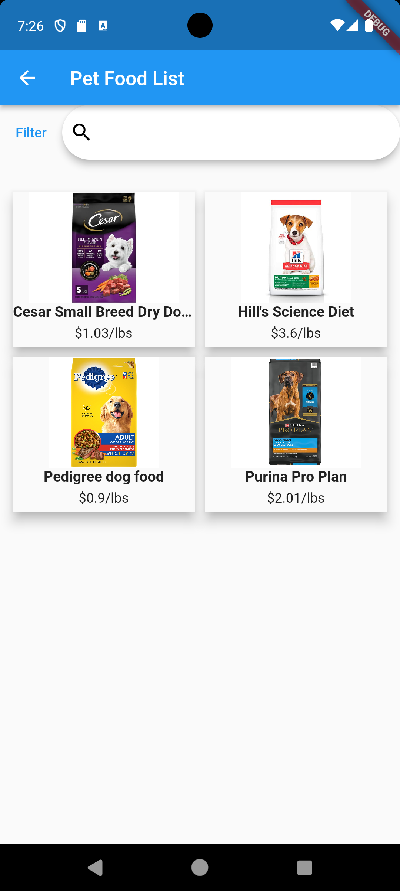

## Table of Contents
* [Motivation](#motivation)
* [Goals](#goals)
* [Usage](#usage)
* [Installation](#installation)
* [Development Status](#development-status)
* [Usability Evaluation](#usability-evaluation)
* [About Us](#about-us)

## Motivation

There are many people who are or want to be pet owners, but don't know all there is to know regarding pet nutrition and health. PetBite seeks to change that by making it quick and easy to see what a pet's nutritional needs are. 

## Goals

Our primary goal is to have a functioning mobile application in which users can receive direct feedback regarding their pet's nutritional needs based on pet information such as weight, height, breed, and age. The application will provide feedback via chatGPT as well as other users who have similar pets. In service of making pet nutrition and health easy to digest, we also have a tracker that keeps track of a pet's meal and exercise times, as well as a pet food page with information and links to buy brands of pet food. Lastly, our application also aims to encourage community interaction and will have a message board where users can create and respond to posts.  

## Usage

* ### Login Page
Users will be able to login through this page using their credentials, or through a linked facebook/apple account. If a user has forgotten their password or doesn't have an account, they can press the "Forgot Password?" or "Register" buttons respectively to be redirected to the appropriate page.

    

* ### Register Page
Users can create a PetBite account on this page by providing a username, a valid email address, a password, and their phone number. Users are also required to read and agree to the Terms and Conditions of the application.

    

* ### Home Page
After logging in, the user is presented with the home page. If the user is new to the application, they would be asked to enter and upload information about their pet. Once the pet's information is entered, the user would see an overview of their pet's information and AI-generated tips for their pet. The user can also update their pet's information later on. If the user has multiple pets entered into the application, they can switch to different pets by swiping up on this page and a navbar would appear at the top of the page. The navbar contains a row of the owner's pet pictures and the user can switch to different pet's page by clicking on one of the pictures.

    
    
    

* ### Feeding Schedule Page
Users can choose between an AI-generated feeding schedule or enter their own feeding schedule for their pet. The schedule card can be swiped to different days of the week and each card would display what the pet should eat on that day. The card displays various information such as the time of the meal, the amount of the meal, and a checkbox for completion. The feeding schedule can also be synchronized with the pet's activity and health, so the schedule can be adjusted in real time as needed.

    

* ### Edit Feeding Schedule Page
Users can add or edit the feeding schedule throughout the week for their pet by inputting the meal name (breakfast, lunch, dinner), time of the meal, the pet food name, and the quantity of the pet food.

    

* ### Activity Log Page
Users can log their pet's daily activities on this page. Logs are tracked in a simple scrolling list of activities, all of which are time stamped. The plus button on the bottom right allows the user to add activity logs. Activities are also separated by day markers.

    
    
    
    

* ### Detailed Activity Log Page
This page provides the user with an overview of activities over a period of time and more detailed information about the current status of their pet, such as weight and calorie intake.

    

* ### Community Tab
Users can access the three functions (Forum, Direct Messaging and Pet Food List Reviews) from this page.

    

* ### Community Forum Page
Users can communicate with other users in this application through this page, which includes a scrolling bar at the top of the application with circles representing different communities. The selected community is highlighted at the top to indicate which community the user is currently in. Below that are post previews from other users. Each post preview includes a like, comment, and share button/status. The preview shows the post's title, content, and images, if uploaded. When a user clicks on one, the page changes to the post page where they can view the post in more detail. At the bottom of the page is a plus sign that allows the user to write their own post. Clicking this button takes the user to the Create Post page.

    

* ### Create Forum Post Page
Users can select the community forum in which they want to post, type the title, and enter the content in the body textbox to create a post in the selected community forum.

    

* ### DM List Page
Users can check their private conversation with other users on this page.

    

* ### DM List Page
Users can chat with others on this site using various regular chat features.

    

* ### Pet Food List Page
Users get recommended pet food based on user's pet information and advice from the community. On this page, user can filter and search for different pet food. Then user can click on the pet food and there will be recommendations from both AI and community.

    

* ### Detailed Pet Food Page
This page provides more information about the pet food the user selects from the Pet Food List page based on AI-generated information. Users can also add their personal review of the pet food.

    

* ### Pet Details Page
Users can input information about their pet on this page. Each pet an owner registers in the app will have their own details page, and it is here where users will be able to update information or delete new pets. Text boxes will be available for all the different aspects of their pet, including things like name, weight, breed, etc. It is also from here that the app will gather information about the pet and determine nutritional suggestions. 

    

* ### Profile Page
Users can change their profile name, picture, access account information and settings page.

    
    

* ### Settings Page
Users can change the application's settings (notifications, time, language, location, etc...) on this page. There is also a help page in case users need support for this application.

    

## Installation

Our project code can be found [here](https://github.com/PetBite/app)

In order to run our code simply:
- download the repo from the provided link
- invoke flutter run

The mobile app is also deployed on Google Play Console

## Development Status

Our development status can be found [here](https://github.com/orgs/PetBite/projects/1)

## Usability Evaluation

The project's usability evaluation can be found [here](https://petbite.github.io/evaluation.html) (updated 12/6/2023)

## About Us

Our team consists of three members:
- [Braydon Nagasako](https://github.com/Breadonn)
- [Wenhao Qiu](https://github.com/wenhaoq20)
- [Keaton Wong](https://github.com/KeatonWong)
